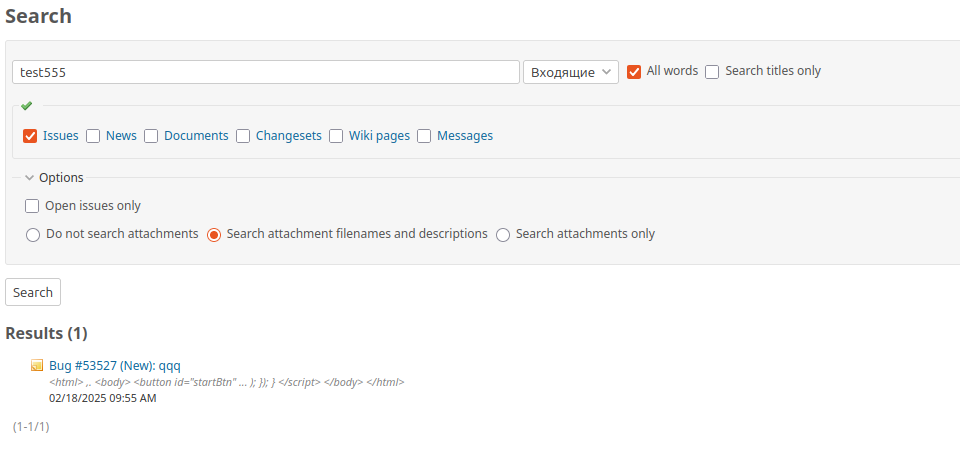

# attachments_description_text
This is a plugin for Redmine, change attachments description type from string to text

Features
----------------------

* Extends the attachment description field from string to text type
* Allows storing longer, more detailed descriptions for attached files
* Enables default text search by file descriptions in Redmine 



Installation
----------------------

* Clone or download repo into your **redmine_root/plugins/** folder

Installation
----------------------

* Clone or download repo into your **redmine_root/plugins/** folder

```
$ git clone https://github.com/apsmir/attachments_description_text.git
```


exec db:migrate 

```
$ bundle exec rake redmine:plugins:migrate NAME=attachments_description_text RAILS_ENV=production

